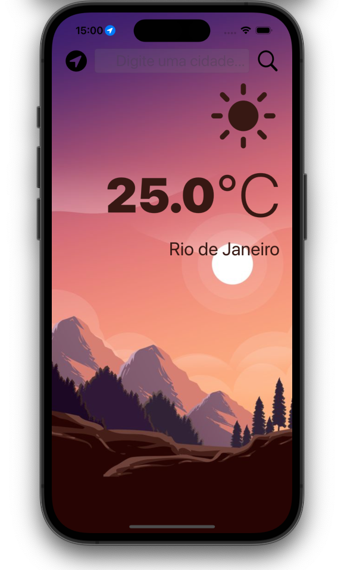

## Our Goal

We’re going to introduce you to the wonderful world of Application Programming Interfaces (APIs) to grab live data from the internet.

## What we create

A beautiful, dark-mode enabled weather app. You'll be able to check the weather for the current location based on the GPS data from the iPhone as well as by searching for a city manually.

## What I've learn

- How to create a dark-mode enabled app.
- How to use vector images as image assets.
- Learn to use the UITextField to get user input.
- Learn about the delegate pattern.
- Swift protocols and extensions.
- Swift guard keyword.
- Swift computed properties.
- Swift closures and completion handlers.
- Learn to use URLSession to network and make HTTP requests.
- Parse JSON with the native Encodable and Decodable protocols.
- Learn to use Grand Central Dispatch to fetch the main thread.
- Learn to use Core Location to get the current location from the phone GPS.

> This is a project made from The App Brewery's Complete App Developement Bootcamp, check out at [www.appbrewery.co](https://www.appbrewery.co/)
